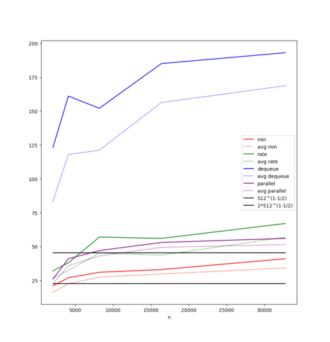
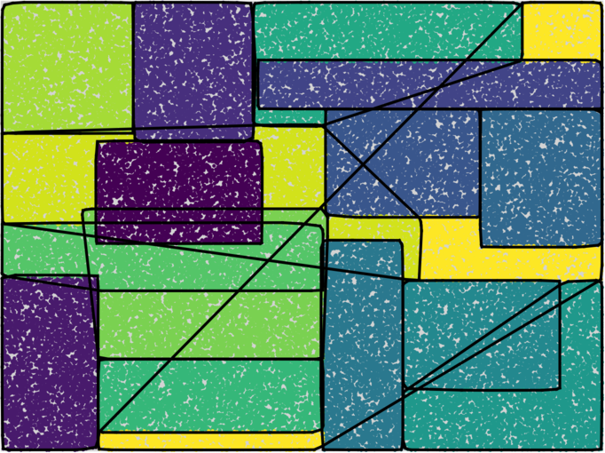

# Visualization scripts

These scripts can be found in the [visualization](./visualization) folder.

`draw_comparison.py [n,t,d] string set_system` draw the graph for the variation of the crossing number depending on either `n`, `t` or `d` for the given type of `set_system`. It gets the data from `results.csv`

`draw_partition.py string file` draws the partition from a partition file

`draw_partition_seq.py string file` draws the partitions from a partition file one after the other