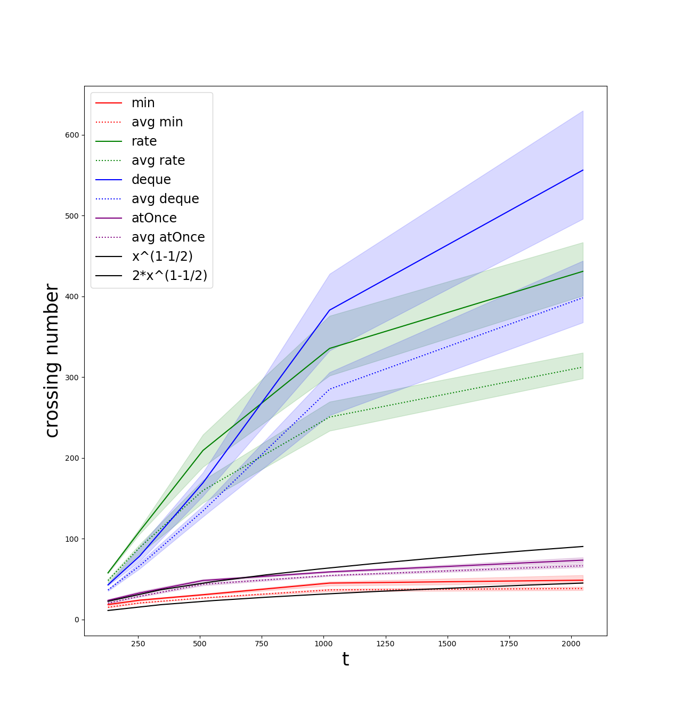

# Visualization scripts

These scripts can be found in the [visualization](./visualization) folder.

`draw_comparison.py [n,t,d] string set_system` draw the graph for the variation of the crossing number depending on either `n`, `t` or `d` for the given type of `set_system`. By default, it gets the data from `results.csv`

`draw_runtime.py [n,t,d] string set_system` draw the graph for the variation of the runtime depending on either `n`, `t` or `d` for the given type of `set_system`. By default, it gets the data from `results.csv`

`draw_partition.py string file (y)` draws the partition from a partition `file`. Add the argument `y` if you don't want the lightgrey grid to be drawn

`draw_partition_seq.py string file` draws the partitions from a partition `file` one after the other

`draw_partition.py string file string edges (y)` draws the partition for a graph set system obtained from osm data from a partition `file`. It will draw the edges stores in the `edges` file. Add the argyment `y` if you want the outline of each partition to be drawn as well
