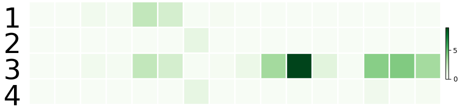

# Visualization scripts

These scripts can be found in the [visualization](./visualization) folder.

`draw_comparison.py [n,t,d] string set_system string filename` draw the graph for the variation of the crossing number depending on either `n`, `t` or `d` for the given type of `set_system` and saves it in `filename`. It gets the data from `results.csv`

`draw_runtime.py [n,t,d] string set_system` draw the graph for the variation of the runtime depending on either `n`, `t` or `d` for the given type of `set_system` and saves it in `filename`. It gets the data from `results.csv`

`draw_partition.py string file (y)` draws the partition from a partition `file`. Add the argument `y` if you don't want the lightgrey grid to be drawn

`draw_partition_seq.py string file` draws the partitions from a partition `file` one after the other

`draw_partition_osm.py string file string edges (y)` draws the partition for a graph set system obtained from osm data from a partition `file`. It will draw the edges stores in the `edges` file. Add the argyment `y` if you want the outline of each partition to be drawn as well

`approx_graphs.py file` draws the graph of error factor from file `file`

`draw_activity.py int n int d int t string filename` draw bar graphs representing the number of violation averaged over the runs with the same parameters `n,d,t` and saves it in `filename`. It gets the data from `potential.csv` and `potential2.csv`.

`draw_violation.py file` draw number of violation in a graph (replaced in the paper by bar plot generated with `draw_activity.py`)

`draw_table.py int n int d int t string ss_type string table_type` output a formatted line of the table `table_type` (either `rate`, `grid`, `pl`, `approx`) from the data in `results.csv` in a latex format to display them in the latex report. In the case of `table_type == pl`, d is replaced with $\beta$.